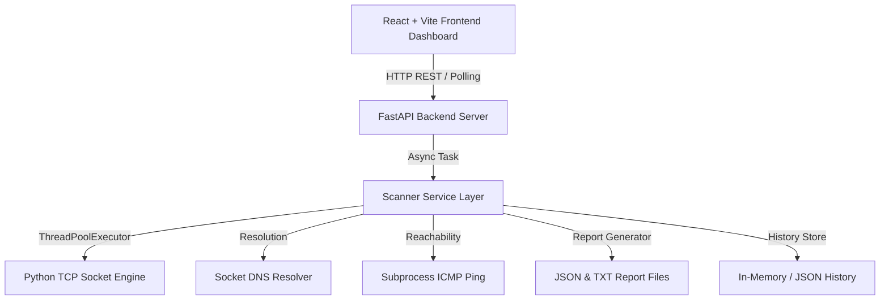

# Network Ping & TCP Port Scanner (Full-Stack Web App)

[](https://www.python.org/)
[](https://fastapi.tiangolo.com/)
[](https://react.dev/)
[](https://vitejs.dev/)
[](https://tailwindcss.com/)
[](https://www.docker.com/)

A modern, high-performance, full-stack network reconnaissance dashboard designed for authorized host reachability verification, ICMP ping testing, and TCP port scanning. Built by converting an existing CLI Python socket scanner into a clean web architecture with a **FastAPI** REST backend and a **React + Tailwind CSS** dark cybersecurity dashboard.

---

## 🌟 Key Features

- **Hostname & IP Resolution**: Automatically resolves domain names (`localhost`, `example.com`) to IPv4 addresses using `socket.gethostbyname()`.
- **ICMP Ping Reachability**: Checks host status prior to scanning (`ping -n 1` on Windows / `ping -c 1` on Linux).
- **Multithreaded TCP Scanning**: High-speed concurrent TCP port scanning using Python's `ThreadPoolExecutor` with configurable thread pools (1 to 500 threads).
- **Real-Time Scan Progress**: Asynchronous live polling showing progress bar percentage, duration timer, and open port statistics.
- **Service Identification**: Automatically maps open ports to standard IANA network services (FTP, SSH, Telnet, SMTP, DNS, HTTP, HTTPS, MySQL, RDP, PostgreSQL, Redis, HTTP-Alt).
- **Interactive Results Table**: Search, sort (ascending/descending), and filter open vs closed ports with status badges (🟢 OPEN / ⚪ CLOSED).
- **Service Detail Modal**: Interactive inspector providing transport protocol, port number, and service descriptions.
- **Report Generation & Download**: Automatically generates structured **JSON** and formatted **TXT** reports downloadable directly from the dashboard.
- **Session Scan History**: Persists scan history during application session with detailed inspect and re-view capabilities.
- **Cybersecurity Dark Visual Theme**: Sleek slate/cyan panel design with micro-animations and responsive layout for desktop, tablet, and mobile displays.

---

## 🏛️ System Architecture



---

## 🛠️ Technology Stack

| Layer | Technologies Used |
| :--- | :--- |
| **Backend** | Python 3.12+, FastAPI, Uvicorn, Pydantic, `ThreadPoolExecutor`, `socket`, `subprocess` |
| **Frontend** | React 18, Vite, Tailwind CSS, Lucide React Icons |
| **API** | REST API with JSON communication and CORS middleware |
| **Testing** | Pytest for backend unit and integration tests |
| **Containerization** | Docker, Docker Compose, Nginx |

---

## 📁 Target Project Structure

```text
network-scanner/
│
├── backend/
│   ├── app/
│   │   ├── __init__.py
│   │   ├── main.py              # FastAPI application & API endpoints
│   │   ├── schemas.py           # Pydantic data schemas
│   │   ├── scanner_service.py   # Multithreaded scan engine wrapper
│   │   ├── report_service.py    # JSON & TXT report generation
│   │   └── history_service.py   # Scan history manager
│   │
│   ├── tests/
│   │   ├── test_scanner_service.py # Unit tests for scanner core logic
│   │   └── test_api.py             # End-to-end FastAPI endpoint tests
│   │
│   ├── requirements.txt
│   └── Dockerfile
│
├── frontend/
│   ├── src/
│   │   ├── components/          # Navbar, Sidebar, ScannerForm, ScanStatusCard, ResultsTable, etc.
│   │   ├── pages/               # DashboardPage, HistoryPage, ReportsPage, AboutPage
│   │   ├── services/            # API client module
│   │   ├── App.jsx              # Main App layout & polling engine
│   │   ├── main.jsx
│   │   └── index.css            # Cyber dark theme styles
│   │
│   ├── package.json
│   ├── vite.config.js
│   ├── nginx.conf
│   └── Dockerfile
│
├── results/                     # Directory storing generated JSON & TXT reports
├── scanner.py                   # Original standalone CLI scanner script (preserved & reused)
├── tests/                       # Original CLI test suite
├── docker-compose.yml
├── README.md
└── .gitignore
```

---

## 🚀 Quick Start & Installation

### Option 1: Running Locally (Without Docker)

#### 1. Backend Setup
```bash
# Navigate to backend directory
cd backend

# Install dependencies
pip install -r requirements.txt

# Start FastAPI backend server
python -m uvicorn app.main:app --reload --port 8000
```
Backend API server will run at: `http://localhost:8000`  
Swagger API Documentation: `http://localhost:8000/docs`

#### 2. Frontend Setup
Open a new terminal window:
```bash
# Navigate to frontend directory
cd frontend

# Install dependencies
npm install

# Start Vite development server
npm run dev
```
Frontend Web Dashboard will run at: `http://localhost:5173`

---

### Option 2: Running with Docker Compose

```bash
# Build and start all services in containerized mode
docker compose up --build
```
- Frontend Web App: `http://localhost:5173`
- Backend REST API: `http://localhost:8000`

---

## 🔌 API Endpoint Documentation

| Method | Endpoint | Description |
| :--- | :--- | :--- |
| `GET` | `/` | API status and version metadata |
| `GET` | `/api/health` | Backend health check status |
| `POST` | `/api/resolve` | Resolves target hostname to IPv4 address |
| `POST` | `/api/ping` | Performs ICMP reachability check on target host |
| `POST` | `/api/scan` | Initiates multithreaded TCP scan job |
| `GET` | `/api/scan/{scan_id}` | Polls status, progress %, metrics, and open ports |
| `POST` | `/api/scan/{scan_id}/cancel` | Requests cancellation of an active scan |
| `GET` | `/api/history` | Retrieves list of session scan summaries |
| `GET` | `/api/history/{scan_id}` | Retrieves full details of a specific scan |
| `GET` | `/api/reports/{scan_id}/json` | Downloads scan report in JSON format |
| `GET` | `/api/reports/{scan_id}/txt` | Downloads scan report in TXT format |

---

## 🧪 Local Verification & Testing Guide

To test the application safely on `localhost`:

1. **Start a local test HTTP server on port 8080**:
   ```bash
   python -m http.server 8080
   ```
2. Open the Network Scanner web dashboard (`http://localhost:5173`).
3. Set **Target Host**: `127.0.0.1`
4. Set **Port Range**: `8000-8100`
5. Click **[Start Scan]**.
6. **Expected Result**:
   - Status transitions from `Resolving` -> `Scanning...` -> `Completed`.
   - Port `8080` appears as **`OPEN`** with service **`HTTP-Alt`** and protocol **`TCP`**.
   - JSON and TXT report downloads become available.

---

## 🔬 Wireshark Traffic Analysis Guide

Wireshark can be used to observe the exact TCP network packets generated during authorized localhost scanning.

### Step-by-Step Traffic Capture:

1. Launch a local listener:
   ```bash
   python -m http.server 8080
   ```
2. Open **Wireshark** and select your local loopback interface (`Adapter for loopback traffic capture` or `Loopback: lo`).
3. Set the Wireshark display filter:
   ```text
   tcp.port == 8080
   ```
4. Initiate a scan against `127.0.0.1` on port `8080` from the web dashboard.
5. **Observe the TCP Three-Way Handshake**:
   - `SYN`: Scanner sends a TCP SYN packet to initiate connection.
   - `SYN-ACK`: Listening service responds with SYN-ACK confirming the port is open.
   - `ACK`: Socket connection completes handshake, after which the connection is closed cleanly (`FIN` or `RST`).

---

## 🧪 Running Pytest Tests

Run the complete test suite (scanner core logic + FastAPI endpoints):

```bash
python -m pytest tests/ backend/tests/ -v
```

Output:
```text
tests/test_scanner.py .....                                              [ 29%]
backend/tests/test_api.py ......                                         [ 64%]
backend/tests/test_scanner_service.py ......                             [100%]
======================== 17 passed in 2.24s ========================
```

---

## 🔒 Security & Responsible Use Disclaimer

This tool is designed strictly for **educational purposes, academic evaluation, college presentations, and authorized network diagnostics**.

- **Authorized Scope**: Perform scans **ONLY** on `127.0.0.1` / `localhost`, systems you explicitly own, or environments where you have explicit written permission to test.
- **Safety Controls**: The scanner enforces thread limits (max 500) and port validation (1-65535). It does **NOT** include stealth scanning, evasion techniques, credential attacks, or vulnerability exploitation routines.

---

## 🎓 Viva & Placement Interview Guide

### 1. Why use `ThreadPoolExecutor` instead of standard sequential loops?
Sequential scanning of 1,000 ports with a 0.5-second socket timeout would take up to 500 seconds (over 8 minutes). Using `ThreadPoolExecutor(max_workers=50)` distributes port probes concurrently across 50 worker threads, reducing total scan duration to under 2 seconds.

### 2. How is real-time progress achieved without WebSockets?
The frontend issues a `POST /api/scan` request to trigger a background worker thread. It receives a unique `scan_id` immediately. The React dashboard then polls `GET /api/scan/{scan_id}` every 400 milliseconds. The backend updates scan progress atomically in memory, enabling smooth UI updates.

### 3. How is code reusability maintained between CLI and Web versions?
The underlying network functions (`resolve_host`, `ping_host`, `parse_ports`, `scan_port`, `get_service_name`) remain untouched in `scanner.py`. The web backend's `scanner_service.py` imports and reuses these functions directly, preserving CLI compatibility while providing web capabilities.

---

## 📄 Author
**Sharmila K Y** - Computer Science Engineering Student
